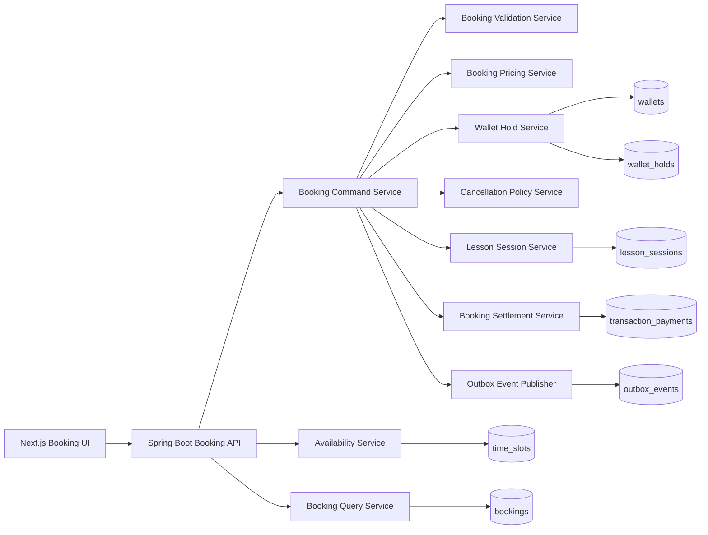
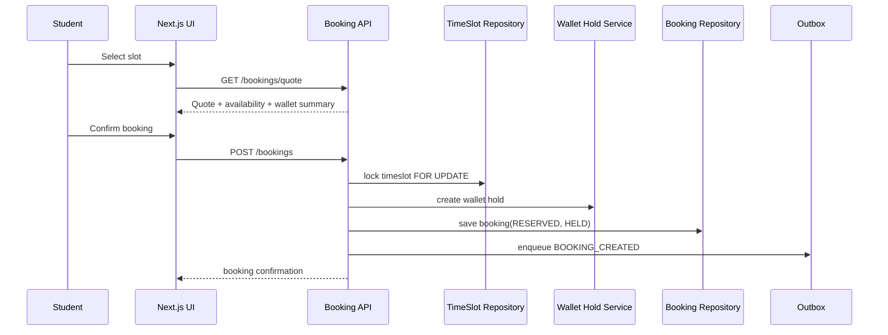
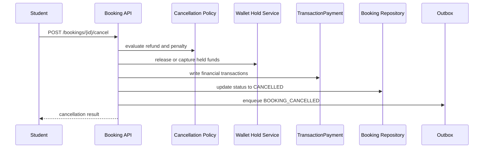
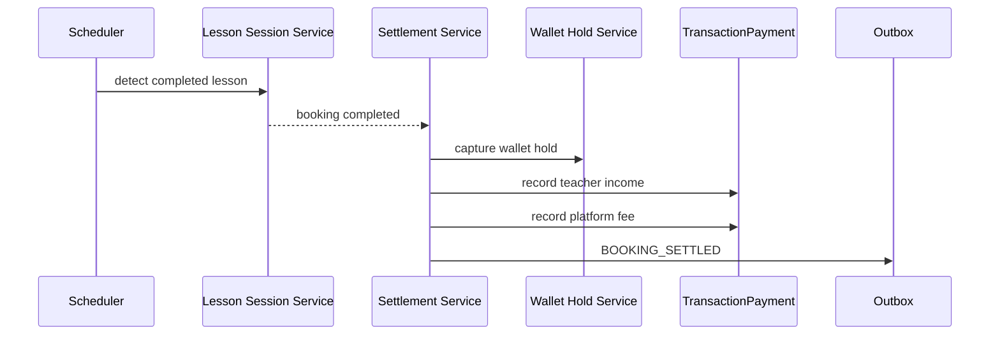

# Teacher Booking Architecture for Cap2

## 1. Current Baseline In This Codebase

The current booking feature already has a usable end-to-end flow:

- Frontend discovery page for open slots.
- Frontend teacher schedule page for selecting one or many slots.
- Frontend checkout page for quote and confirmation.
- Frontend "my bookings" page with cancellation.
- Backend discovery and teacher availability APIs.
- Backend single booking and bulk booking APIs.
- Backend wallet freeze logic.
- Backend cancellation policy with audit logging.

Observed implementation anchors:

- Frontend pages:
  - `src/app/(user)/booking/page.tsx`
  - `src/app/(user)/booking/teacher-schedule/page.tsx`
  - `src/app/(user)/booking/bookappointment/page.tsx`
  - `src/app/(user)/booking/bookingmodal/page.tsx`
- Frontend data layer:
  - `src/store/services/bookingApi.ts`
  - `src/types/booking.ts`
- Backend controllers:
  - `src/main/java/com/example/fuji/controller/TimeSlotController.java`
  - `src/main/java/com/example/fuji/controller/BookingController.java`
- Backend services:
  - `src/main/java/com/example/fuji/service/TimeSlotService.java`
  - `src/main/java/com/example/fuji/service/BookingService.java`
- Backend persistence:
  - `src/main/java/com/example/fuji/entity/TimeSlot.java`
  - `src/main/java/com/example/fuji/entity/Booking.java`
  - `src/main/java/com/example/fuji/entity/Wallet.java`
  - `src/main/java/com/example/fuji/entity/TransactionPayment.java`

This means the right design direction for Cap2 is not a rewrite. The right direction is to keep the current API shape where possible, then refactor the booking domain into clearer modules and stronger state management.

## 2. What Is Already Good

The current implementation has several strong foundations:

- Pessimistic locking is already used when creating a booking through `TimeSlotRepository.findByIdForUpdate`.
- Bulk booking is already supported, which is a useful product differentiator.
- Wallet available balance and frozen balance are separated.
- Discovery and teacher-specific availability are already exposed as dedicated APIs.
- Cancellation already applies a policy and records an audit trail.

These are the correct building blocks for a professional architecture.

## 3. Current Gaps That Should Be Fixed

### 3.1 Business Logic Is Too Concentrated

`BookingService` is currently doing too many jobs:

- validation
- slot locking
- pricing
- wallet hold
- booking creation
- cancellation policy
- teacher compensation
- student penalty
- audit serialization
- booking list mapping

This makes the service hard to test, hard to evolve, and risky when new states such as lesson completion or teacher no-show are added.

### 3.2 Booking State Is Not Consistent Across The System

Current code suggests different meanings for booking states:

- `Booking.java` comments mention `PENDING`, `CONFIRMED`, `CANCELLED`
- `BookingService.matchStatus()` maps `COMPLETED` view to `CONFIRMED`
- `TeacherIncomeService` queries counts by `COMPLETED`, `CANCELLED`, `PENDING`

This is a domain inconsistency. Reporting, teacher income, and UI filtering will drift over time if state names do not represent the same lifecycle.

### 3.3 Cancellation Deletes The Booking Row

`cancelBooking()` currently deletes the booking entity after writing audit data.

This is not ideal for a production booking system because:

- reporting becomes indirect
- teacher analytics lose first-class booking history
- reconciliation becomes harder
- support and dispute handling become harder
- future features such as rebooking, incident review, and session history become fragile

### 3.4 Time Slot Status And Booking Ownership Are Duplicated

`TimeSlot.status` and active booking existence both represent availability.

That creates duplicated truth:

- slot can be `BOOKED`
- booking may or may not still exist
- slot search also checks booking table again

The system should have one clear source of truth for availability reservation.

### 3.5 No Explicit Session Lifecycle

The system has booking and cancellation, but no clear lifecycle for:

- lesson reminder
- check-in
- session start
- session completion
- no-show
- teacher-side cancellation

Without this layer, teacher income and booking completion cannot be modeled cleanly.

### 3.6 Financial Settlement Is Coupled To Ad-Hoc Transactions

Teacher income is currently derived from `TransactionPayment` records, but there is no explicit settlement step after a class finishes.

For a professional design, the platform should distinguish:

- booking reservation
- wallet hold
- cancellation refund/penalty
- final lesson settlement
- teacher payout eligibility

### 3.7 Timezone Handling Is Too Static

Current responses hardcode `Asia/Ho_Chi_Minh`.

For a booking domain, timezone must be explicit and centralized, especially for:

- slot display
- booking reminders
- cancellation cutoff
- calendar rendering
- teacher/student in different timezones

## 4. Target Domain Design

The recommended design is a domain-oriented booking architecture with six clear capabilities:

| Capability | Responsibility | Current Mapping | Target Owner |
|---|---|---|---|
| Availability | Publish and discover open teaching slots | `TimeSlotService` | `AvailabilityService` |
| Booking | Reserve slots and manage booking lifecycle | `BookingService` | `BookingCommandService` |
| Pricing | Service fee, total, quote snapshots | `BookingPricingService` | `BookingPricingService` |
| Wallet Hold | Freeze, release, capture booking funds | inline in `BookingService` | `WalletHoldService` |
| Session | Attendance, start, end, no-show, completion | missing | `LessonSessionService` |
| Settlement | Teacher compensation, platform fee, refund, payout basis | partial | `BookingSettlementService` |

This separation matches the current codebase style while making the domain professional and maintainable.

## 5. Recommended Backend Architecture

### 5.1 Logical Flow



### 5.2 Package Split

Recommended package layout without fighting the current Spring Boot structure:

```text
src/main/java/com/example/fuji/
  controller/
    BookingCommandController.java
    BookingQueryController.java
    TimeSlotController.java

  dto/
    request/
    response/

  service/
    booking/
      AvailabilityService.java
      BookingCommandService.java
      BookingQueryService.java
      BookingValidationService.java
      BookingPricingService.java
      WalletHoldService.java
      CancellationPolicyService.java
      LessonSessionService.java
      BookingSettlementService.java
      BookingEventPublisher.java

  scheduler/
    BookingReminderScheduler.java
    BookingSettlementScheduler.java
    ExpiredBookingScheduler.java

  repository/
    BookingRepository.java
    BookingStatusHistoryRepository.java
    WalletHoldRepository.java
    LessonSessionRepository.java
    OutboxEventRepository.java
```

This is a good fit for Cap2 because it keeps the existing layered architecture and only makes the booking domain more explicit.

## 6. State Model

### 6.1 Booking State

Use a dedicated booking state that reflects lesson lifecycle:

| Booking State | Meaning |
|---|---|
| `RESERVED` | Slot locked and wallet hold created |
| `READY` | Upcoming class, still active |
| `IN_SESSION` | Class has started |
| `COMPLETED` | Class finished successfully |
| `CANCELLED` | Cancelled by student, teacher, or system |
| `NO_SHOW` | One side did not attend |
| `EXPIRED` | Reservation expired before lesson start |

### 6.2 Settlement State

Do not overload booking status with finance.

Use a separate settlement state:

| Settlement State | Meaning |
|---|---|
| `HELD` | Money is frozen in wallet |
| `RELEASED` | Hold released fully |
| `PARTIAL_REFUND` | Partial refund was applied |
| `CAPTURED` | Final lesson payment captured |
| `REFUNDED` | Full refund issued |
| `SETTLED` | Teacher and platform accounting completed |

This split is one of the most important upgrades for the current codebase.

## 7. Recommended Data Model

### 7.1 Keep Existing Core Tables

Keep and evolve:

- `time_slots`
- `bookings`
- `wallets`
- `transaction_payments`
- `audit_logs`

### 7.2 Add Focused Booking Tables

Add the following tables for a production-grade design:

#### `booking_status_history`

Purpose:

- immutable lifecycle timeline
- audit without deleting business rows
- support debugging and customer support

Suggested fields:

- `id`
- `booking_id`
- `from_status`
- `to_status`
- `actor_type`
- `actor_id`
- `reason`
- `metadata_json`
- `created_at`

#### `wallet_holds`

Purpose:

- track which frozen balance belongs to which booking
- simplify refund and settlement calculations
- remove ambiguity from a single `frozenBalance` number

Suggested fields:

- `id`
- `booking_id`
- `wallet_id`
- `amount`
- `status`
- `captured_amount`
- `released_amount`
- `created_at`
- `updated_at`

#### `lesson_sessions`

Purpose:

- attendance
- reminder readiness
- lesson completion
- no-show policy

Suggested fields:

- `id`
- `booking_id`
- `teacher_joined_at`
- `student_joined_at`
- `started_at`
- `ended_at`
- `session_status`
- `attendance_result`
- `metadata_json`

#### `outbox_events`

Purpose:

- reliable notifications
- reminder emails
- websocket push
- analytics fan-out

Suggested fields:

- `id`
- `aggregate_type`
- `aggregate_id`
- `event_type`
- `payload_json`
- `status`
- `created_at`
- `processed_at`

## 8. Booking Flow Design

### 8.1 Single Booking Flow



### 8.2 Cancellation Flow



### 8.3 Lesson Completion And Settlement



## 9. API Design Recommendation

The current endpoint set is good enough to preserve with limited changes.

### 9.1 Keep These Public APIs

- `GET /api/time-slots/discovery`
- `GET /api/time-slots/teacher/{teacherId}/availability`
- `GET /api/bookings/quote`
- `POST /api/bookings`
- `POST /api/bookings/bulk`
- `GET /api/bookings/me`
- `POST /api/bookings/{id}/cancel`

### 9.2 Add These Next

- `GET /api/bookings/{id}`
- `GET /api/bookings/{id}/timeline`
- `POST /api/bookings/{id}/check-in`
- `POST /api/bookings/{id}/complete`
- `POST /api/bookings/{id}/teacher-cancel`
- `POST /api/bookings/{id}/mark-no-show`

The key design rule is: do not overload a single cancel endpoint for every future policy case.

## 10. Frontend Architecture Recommendation

The current frontend pages should remain as route shells, but business logic should move into a feature module.

Recommended structure:

```text
src/
  features/
    booking/
      api/
        bookingApi.ts
      components/
        BookingDiscoveryPage.tsx
        TeacherSchedulePicker.tsx
        BookingCheckoutPanel.tsx
        MyBookingsPanel.tsx
      hooks/
        useBookingSelection.ts
        useBookingCheckout.ts
        useBookingTimezone.ts
      model/
        booking.types.ts
        booking.constants.ts
      utils/
        booking-format.ts
        booking-status.ts
```

### 10.1 Route Ownership

Keep route files thin:

- `src/app/(user)/booking/page.tsx`
  - discovery shell only
- `src/app/(user)/booking/teacher-schedule/page.tsx`
  - teacher schedule shell only
- `src/app/(user)/booking/bookappointment/page.tsx`
  - checkout shell only
- `src/app/(user)/booking/bookingmodal/page.tsx`
  - booking history shell only

### 10.2 Frontend State Rules

Use these simple state rules:

- URL query params should identify selection context.
- RTK Query should own server state.
- local component state should only own selection UI and modal visibility.
- booking status labels should come from a shared status map.
- timezone formatting should be centralized in one utility.

This will reduce the amount of booking logic spread directly inside page files.

## 11. Reporting And Teacher Income

Teacher income should not depend on raw booking status names alone.

Recommended rule:

- booking completion drives settlement
- settlement writes immutable financial transactions
- teacher dashboard reads settlement-backed transactions
- booking dashboard reads booking lifecycle history

That means:

- `TeacherIncomeService` should primarily rely on settlement transactions
- booking analytics should use `booking_status_history`
- cancelled bookings should remain queryable as first-class booking records

## 12. Operational Hardening

For a professional production module, add the following safeguards:

### 12.1 Idempotency

Use idempotency keys for:

- create booking
- bulk booking
- cancel booking

This protects against browser retries and double-submit behavior.

### 12.2 Notifications

Use outbox-driven notifications for:

- booking created
- reminder 24h before class
- reminder 1h before class
- booking cancelled
- lesson completed

### 12.3 Metrics

Track:

- quote to booking conversion rate
- booking failure rate
- insufficient wallet rate
- late cancellation rate
- no-show rate
- average teacher utilization

### 12.4 Reconciliation

Add scheduled checks to detect:

- booking without wallet hold
- wallet hold without booking
- completed lesson without settlement
- cancelled booking with unreleased hold

## 13. Best-Fit Implementation Plan For Cap2

### Phase 1: Stabilize Current Booking Module

- Split `BookingService` into command, query, validation, and cancellation policy services.
- Stop deleting bookings on cancel.
- Add `booking_status_history`.
- Align all code to one booking status vocabulary.
- Centralize timezone formatting.

### Phase 2: Add Session And Settlement

- Add `lesson_sessions`.
- Add explicit lesson completion and no-show flows.
- Add `wallet_holds`.
- Add settlement service and scheduler.
- Move teacher income reporting to settlement-driven queries.

### Phase 3: Make It Production-Ready

- Add outbox events.
- Add notifications and reminders.
- Add idempotency keys.
- Add operational metrics and reconciliation jobs.

## 14. Final Recommendation

For this Cap2 project, the most professional and practical architecture is:

- keep the current route and endpoint shape
- refactor the backend into focused booking services
- separate booking state from settlement state
- stop deleting booking records on cancellation
- add wallet hold and lesson session tables
- move teacher income to settlement-based accounting

This gives the project a clear path from a working student-teacher booking feature to a production-grade scheduling and payment domain without forcing a full rewrite.
